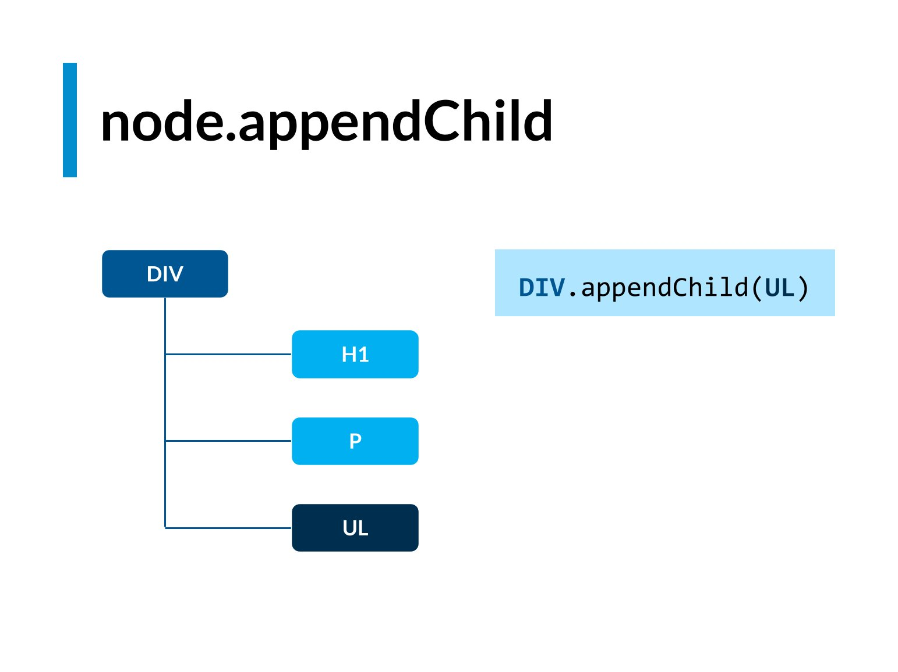

Para ver el tiempo del momento en lenguaje humano

```javascript
console.log(new Date().toLocateTimeString();)
```

# DOM

JavaScript crea un objeto **_document_** para guardar todo el HTML de la web
Es un objeto de javascript construido cuando levantamos una instacia de HTML

```javascript
console.dir(document);
console.dir(document.body);
```

Children .- Todos los que podrian tener hijos
ChildNodes .- Todos los nodos de una estructura HTML

innerHTML .- Tiene todos los elementos del elemento body
innerText .- Tiene todos el continido de texto


### Pasar NodeList a Array

```javascript
// Los node List No se pueden manipulart coimo arrays en su totalidad
const nodeList = document.querySelectorAll(
  "name className or idName or tagName "
);
// Convertir NodeList a array
const newNodeListArray1 = [...nodeList];
const newNodeListArray2 = Array.from(nodeList);
```


# DOM Javascript en pdf

[Pdf de DOM Javascript de platzi](https://wilcahuaya.netlify.app/pdf/javascript_platzi.pdf)

## Crear un elemento

### document.createElemnt

```javascript
h1 = document.createElememt("ELEMENTO"); // h1, p, etc...
```

## Crear un texto

### document.createTextNode

```javascript
texto = document.createTextNode("TEXTO");
```

## Agregar Nodos

## parentElement.appendChild(nodo)



```javascript
h1.appendChild(texto);
//Tambien se puede agregar un texto a un nodo de esta manera
h1.textContent = "TEXTO";
div.appendChild(h1);
```

## parentElement.append

## parentElement.insertBefore

## parentElement.insertAdjacentElement

# Algunos metodos de javcascript

Para eliminar un elemento de un array

- splice

# LOCAL STORAGE

Ecadenar objetos a string

```javascript
people = [
  {
    name: "Wilder",
    lastname: "Cahuaya Quispe",
  },
  {
    name: "Juan",
    lastname: "Perez Lazaro",
  },
];

JSON.stringify(people);
// '[{name: "Wilder", lastname: "Cahuaya Quispe"}, {name: "Juan", lastname: "Perez Lazaro"}]'
```

Local store solo guarda en estring por eso se encadena los objetos que deseas guardar

```javascript
localStorage.setItem("people", JSON.stringify(people));
```

Para obtener el string de local storage y parsearlo a array

```javascript
peopleFromStorage = localStorage.getItem("people");
//'[{"name":"Wilder","lastname":"Cahuaya Quispe"},{"name":"Juan","lastname":"Perez Lazaro"}]'
JSON.parse(peopleFromStorage);
```

Para prevenir el comportamineto por defauld del submit de los formularios

```javascript
const form = document.querySelector("#expense-form");
form.addEventListener("submit", (event) => {
  event.preventDefault();
});
```

Para traer los elementos del formulario

```javascript
event.target.elements;
const { name, lastname } = event.target.elements;

const newUser = {
  name: name.value,
  lastname: lastname.value,
};
```

Para redireccionar hacia el index

```javascript
location.assign("/");
```
