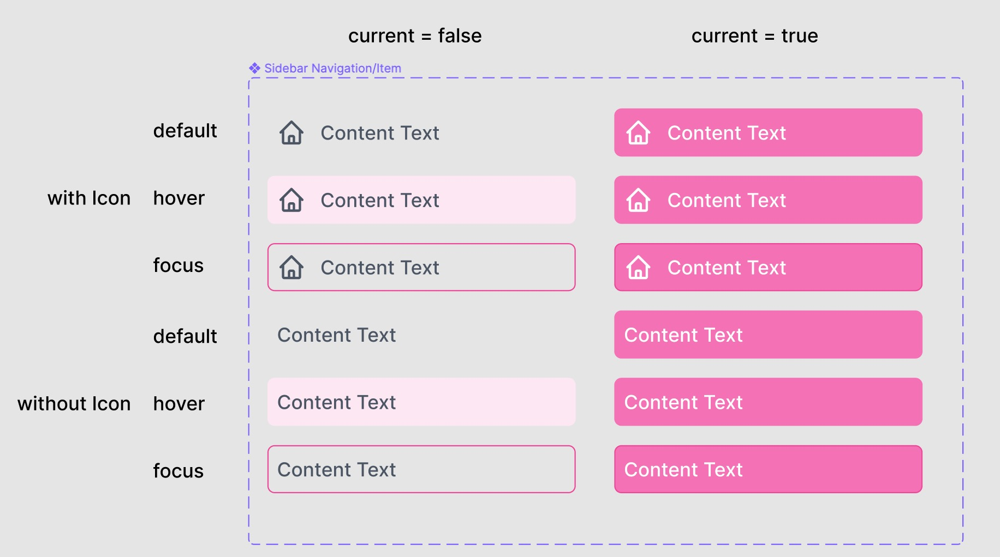
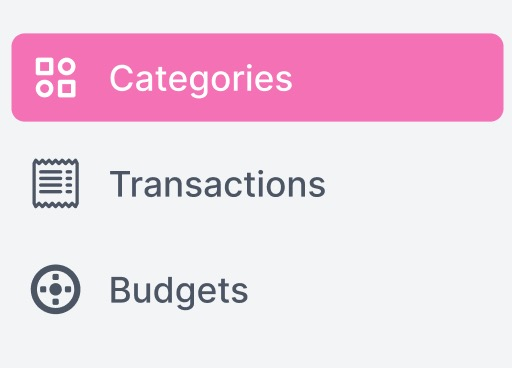
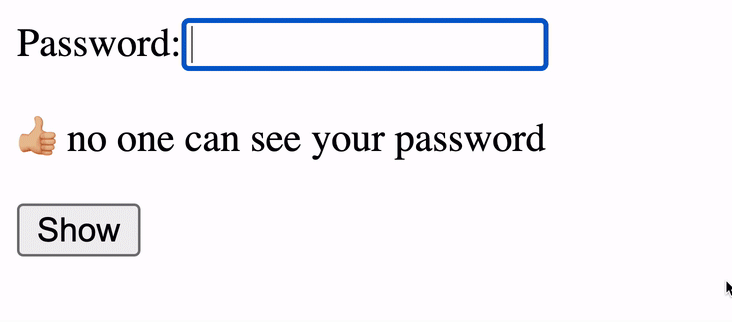
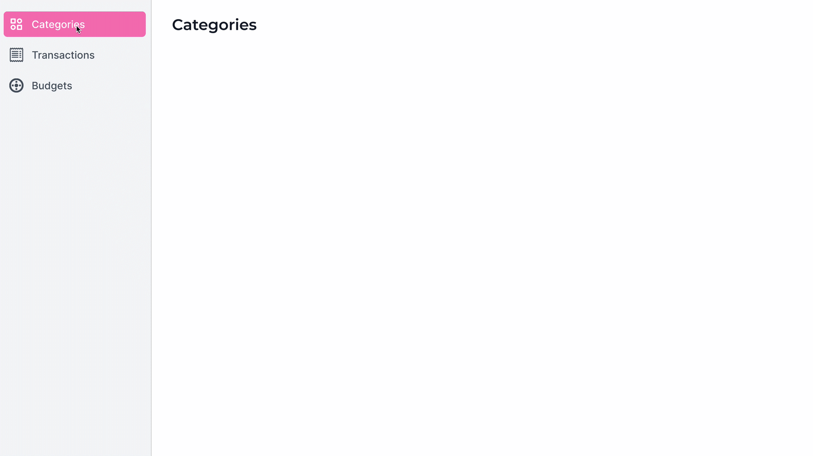

# Prop Types

## Create a component with prop types validations

Create a re-usable custom component for Codeable's design Sidebar Item.

SideBar Item



```javascript
prop        | options
------------+----------------------------
href        | string, default: "#"
------------+----------------------------
curren      | boolean, default: false
------------+----------------------------
icon        | svg element
```

You should be able to use the Button component like this:

```javascript
const icon = <svg>...</svg>

<SidebarItem href="www.example.com" current={true} icon={icon}>
  Example Page
</SidebarItem>
```

The component should implement the PropTypes feature to show warnings on the console when the props are invalid.

Check [here the Figma file](https://www.figma.com/file/Crqtn0kqnB1EKQWZVXE3of/Expensable-React?node-id=4101%3A1163)

#### Resolución:

# Render Lists

## Renders a list of SidebarItems

Given an array of objects representing Sidebar Items, render them inside a nav element:



```javascript
const categoryIcon = <svg>...</svg>;
const transactionIcon = <svg>...</svg>;
const budgetIcon = <svg>...</svg>;

function SidebarNav() {
  const navigation = [
    { name: "Categories", icon: "categoryIcon", href: "#", current: true },
    {
      name: "Transactions",
      icon: "transactionIcon",
      href: "#",
      current: false,
    },
    { name: "Budgets", icon: "budgetIcon", href: "#", current: false },
  ];

  return <nav>{/* // complete your code here */}</nav>;
}
```

Check [here the Figma file](https://www.figma.com/file/Crqtn0kqnB1EKQWZVXE3of/Expensable-React?node-id=4101%3A1163)

#### Resolución:

# React State

## Password component with state

Using react useState hook, create the following component



The input should change between `type="text"` and `type="password"` based on the `show` state (true or false)

**_Controlled password_**

Make sure that the input value is controlled by React. What could you do to make sure that the password value could never have whitespaces?

#### Resolución:

# Lifting State

## App with Sidebar Navigation

Put all the pieces together and build an App with a sidebar and main section as following:



The following is obviously incomplete but the the idea is to render the SideBarNav and Main components side by side inside a div container

```javascript
function App() {
  // complete the neccesary states

  // pass the neccesary props to SidebarNav and Main components
  return (
    <div>
      <SidebarNav />
      <Main />
    </div>
  );
}
```

Check [here the prototype](https://www.figma.com/proto/Crqtn0kqnB1EKQWZVXE3of/Expensable-React?page-id=4157%3A1881&node-id=4157%3A1882&viewport=241%2C48%2C0.43&scaling=contain&starting-point-node-id=4157%3A1882)

Check [here the Figma page](https://www.figma.com/file/Crqtn0kqnB1EKQWZVXE3of/?node-id=4157%3A1881)

#### Resolución:
